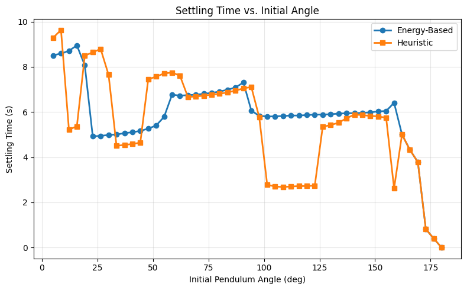
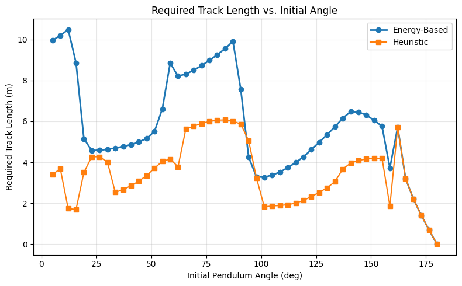

# Inverted Pendulum Control

> State-feedback controllers that balance a pendulum on a cart in an upright position, simulated in Python. 


---

## Overview

**The problem:** An inverted pendulum mounted on a motor-driven cart that slides along a horizontal rail. The upright positon is an open-loop unstable equilibrium, and the system is underactuated with the cart motor controling both cart position and the pole angle. The objective of this project is bring the pole to the upright position and hold it there, while keeping the cart close to its starting position and recover from disturbances. 

**The approach:** The essence of the controllers is the LQR (Linear-quadratic regulator). I derived the equations of motion using lagrangian mechanics and sympy, linearized them about the upright position, and used the state-feedback law **u = -Kx** that minimizes a quadratic cost on state error and control effort. I chose LQR because the gain is optimized and outperforms hand-tuning. The Q and R weighting matrices give clear control over the characteristics of the controller, allowing me to set which variables are more important and affect settling times and overshoots. A "swing-up" mode is used to ensure that that pole can reach the region where the LQR can catch and stabilize it. 

**The outcome:** The LQR controller is capable of swinging the pole up from rest and balancing it upright within ~8 seconds while recentering the cart over ~20 seconds. The PID baseline keeps the pole up, but revealed that full state feedback was necessary. 

---

## Results

Both controllers have a 100% success rate when tested against 50 starting angles between 5 and 180 degrees from vertically downward. The settling time for the energy-based swing-up controller had a median settling time 0.14 seconds higher than my heuristic swing-up controller and had worst-case track length 4.41 m longer. The median track length of my heuristic controller was also 1.8 m shorter. 

| Controller | Median Settling Time | Max Track |  Median Track  |
|---|---|---|---|
| LQR + Energy-based |  5.90 s  |  10.48 m  |  5.26 m  |
| LQR + Heuristic |  5.76 s  |  6.07 m  |  3.46 m  |




The plots of track length and settling time against initial angle show these results in detail. The plots of the heuristic swing-up controller are much more jagged than the energy-based controller, which may be explained by the fact that the applied force is discontinuous and results in huge force jumps over small angle changes. 


---

## System & Method

- **Single Pendulum:** State is [x, ẋ, θ, θ̇], with θ = π defined as upright. The nonlinear cart-pole equations are integrated with scipy.integrate.solve_ivp. For the LQR, the dynamics are linearized analytically about the upright equilibrium to get A and B, and the gain K is found by solving the continuous-time algebraic Riccati equation (scipy.linalg.solve_continuous_are), giving u = −Kx. Weightings Q = diag(0.1, 1, 50, 400) and R = 1/F_max² prioritize pole angle and rate while penalizing actuator effort. Force is saturated at F_max (20–50 N depending on the notebook).
- **Controller:** When the pole is far from upright (|angle error| > 45°) and moving slowly, the controller applies a force aligned with the pole's energy gradient to pump it up, reduced when the cart is already displaced so it doesn't run out of rail. Once inside the catch window, control switches to LQR.
- **Double Pendulum:** Same state as single pendulum, but θ = 0 is defined as upright. The full nonlinear equations of motion are derived symbolically with SymPy's LagrangesMethod from the system's kinetic and potential energy, then linearzied about the target via the symbolic Jacobian, with the LQR gain computed through python-control (control.lqr). 

---

## Tech Stack

- **Language:** Python (Jupyter Notebooks)
- **Modeling:** SymPy (Lagrangian mechanics, symbolic linearization)
- **Control and Numerics:** NumPy, SciPy, python-control
- **Visualization:** Matplotlib (Plots and animations; FFmpeg for GIF/MP4 export)

---

## Repository Structure

```
.
├── notebooks/            # Simulation and controller notebooks
├── figures/           # Plots and animations showing simulated response
├── requirements.txt
└── README.md
```

---

## How to Run

```bash
git clone https://github.com/PremYaragarla/Inverted-Pendulum.git
cd Inverted_Pendulum
pip install -r requirements.txt
jupyter lab         # Or Jupyter Notebook
```


**Requirements:** [numpy, scipy, sympy, matplotlib, control, jupyter, or `pip install -r requirements.txt`, plus any hardware]

**FFMPEG** must also be installed to export the GIF/MP4 animations, all other cells run without it. Only the animation cells will return errors. 

---

## What I'd Improve Next

- **Finish the inverted double pendulum.** The lagrangian and LQR pipeline are complete, but tuning and ensuring stability of the sytem will take more time. While the controller works for a small range of initial conditions, it is far from complete and more research needs to be done to find the ideal control methods. In the future, swing-up controllers can also be created for the double pendulum to increase the range of stable initial conditions. 
- **Test Robustness.** Add sensor noise, measurement delays, and slight model-mismatch to see how far the LQR will hold up. This would be accompanied by moving towards a fixed sample rate as a step toward running the controller in a live simulation. Furthermore, the controllers can be brought to real hardware with real-time integration. 